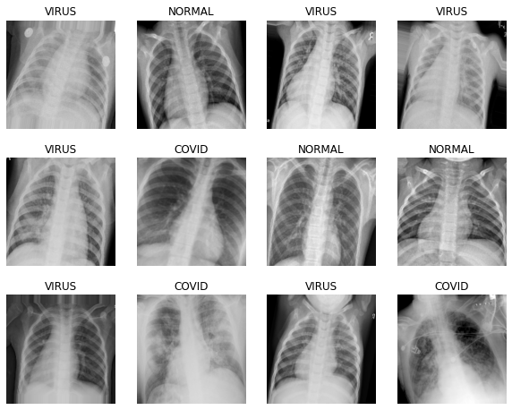

# Detecting-COVID-19-with-chest-X-Ray
Objective of this project is to create an image classification model that can predict Chest X-Ray scans that belong to one of the three classes: Normal, Virus, COVID with a reasonably high accuracy using pre trained VGG-16 & DenseNet models.

