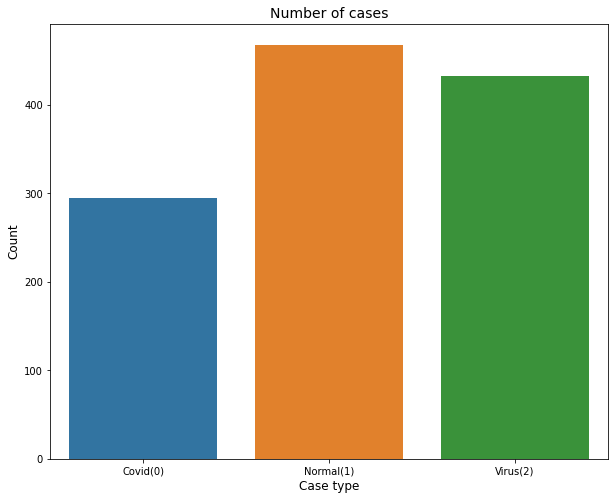

# Detecting-COVID-19-with-chest-X-Ray
Objective of this project is to create an image classification model that can predict Chest X-Ray scans that belong to one of the three classes: Normal, Virus, COVID with a reasonably high accuracy using pre trained VGG-16 & DenseNet models.

# Description
The project utilizes a dataset of images which can be found at Kaggle [here](https://www.kaggle.com/competitions/shai-level-2-training/data).
The dataset contains a total of 1196 images with a significant class imbalance due to under-representation of the COVID class.
- 468 `normal` images
- 433 `viral pneumonia` images
- 295 `COVID` images

